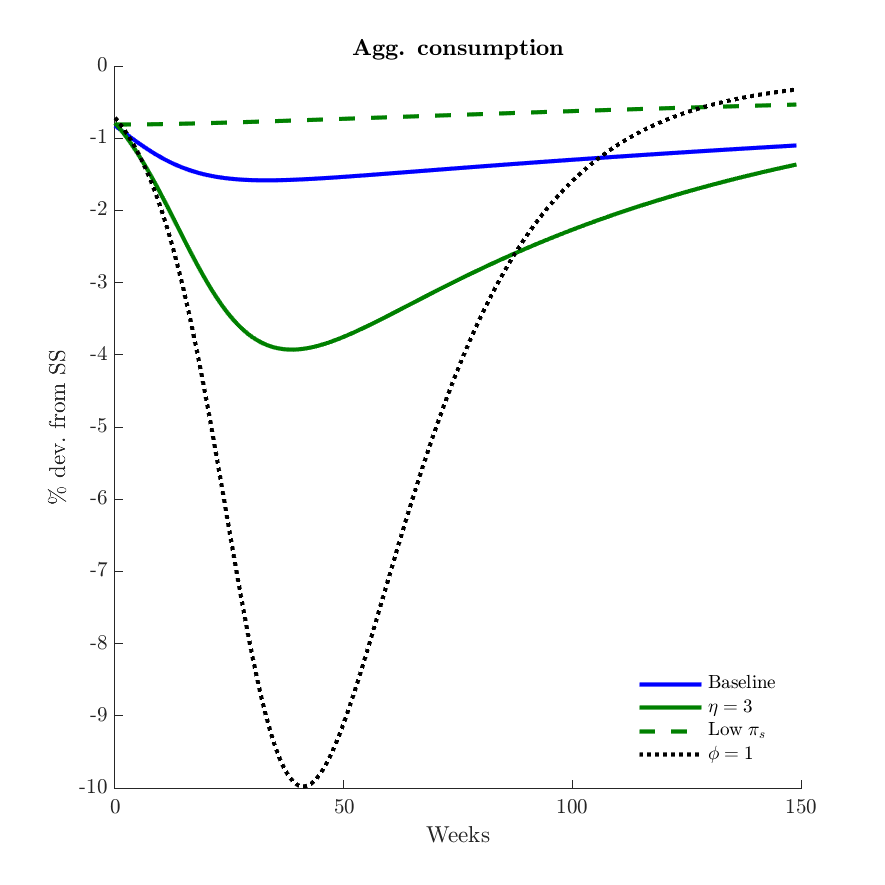

# Macroeconomic Dynamics and Reallocation in an Epidemic
**Authors:** Krueger, D. (U Penn), H. Uhlig (U Chicago), and T. Xie (NUS)\
**Paper:** <https://www.nber.org/papers/w27047>\
**Written on:** September 30, 2020

## Abstract
In this paper we argue that endogenous shifts in private consumption behavior across sectors of the economy can act as a potent mitigation mechanism during an epidemic or when the economy is re-opened after a temporary lockdown. Extending the theoretical framework proposed by Eichenbaum-Rebelo-Trabandt (2020), we distinguish goods by their degree to which they can be consumed at home rather than in a social (and thus possibly contagious) context. We demonstrate that, within the model the "Swedish solution" of letting the epidemic play out without government intervention and allowing agents to shift their sectoral behavior on their own can lead to a substantial mitigation of the economic and human costs of the COVID-19 crisis, avoiding more than 80 of the decline in output and of number of deaths within one year, compared to a model in which sectors are assumed to be homogeneous.  For different parameter configurations that capture the additional social distancing and hygiene activities individuals might engage in voluntarily, we show that infections may decline entirely on their own, simply due to the individually rational re-allocation of economic activity: the curve not only just flattens, it gets reversed.

## Main findings
 

## Files

- **multisector.mod** - dynare file with model equations
- **ModelEquations.mod** - equations in the model